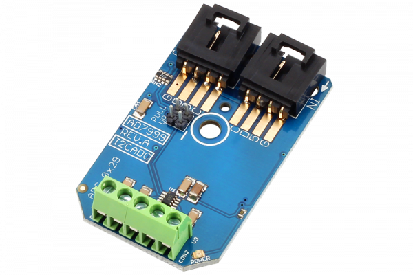

#AD7999

The AD7999 is an I2C programmable resolution quad-channel analog to digital converter, capable of processing 22,500 samples per second.nd 10,000ppm.The AD7999 uses a 5V reference voltage for all 4 input channels; however, the last channel may be sacrificed to serve as an external reference voltage input. The AD7999 has a fixed I2C address of 0x29, allowing one device per I2C port.
This Device is available from www.ncd.io 

[SKU: AD7999_I2CS]

(https://store.ncd.io/product/ad7999-4-channel-81012-bit-analog-to-digital-converter-i2c-mini-module/)
This Sample code can be used with Arduino.

Hardware needed to interface AD7999 ADC with Arduino

1. <a href="https://store.ncd.io/product/i2c-shield-for-arduino-nano/">Arduino Nano</a>

2. <a href="https://store.ncd.io/product/i2c-shield-for-arduino-micro-with-i2c-expansion-port/">Arduino Micro</a>

3. <a href="https://store.ncd.io/product/i2c-shield-for-arduino-uno/">Arduino uno</a>

4. <a href="https://store.ncd.io/product/dual-i2c-shield-for-arduino-due-with-modular-communications-interface/">Arduino Due</a>

5. <a href="https://store.ncd.io/product/ad7999-4-channel-81012-bit-analog-to-digital-converter-i2c-mini-module/">AD7999 4channel 8/10/12bit ADC</a>

6. <a href="https://store.ncd.io/product/i%C2%B2c-cable/">I2C Cable</a>

AD7999:

The AD7999 is an I2C programmable resolution quad-channel analog to digital converter, capable of processing 22,500 samples per second.nd 10,000ppm.The AD7999 uses a 5V reference voltage for all 4 input channels; however, the last channel may be sacrificed to serve as an external reference voltage input. The AD7999 has a fixed I2C address of 0x29, allowing one device per I2C port.

Applications:

•System monitoring

•Data acquistion

•Battery powered systems

•Medical instruments

How to Use the AD7999 ADC with Arduino Library
The AD7999 has a number of settings, which can be configured based on user requirements.

1.Channel selection:The following command is used to select the input voltage channel.

          ad.setChannel(CHANNEL_VIN0);               // Convert on VIN0
